```mermaid
gantt
  title <Project title> — <version> (relative effort, 1pt ≈ 1d)
  dateFormat X
  axisFormat %s

  section Done
  001 Set up Postgres schema      :done, t001, 0, 3d
  section In progress
  004 Billing webhook handler     :active, t004, after t001, 5d
  section Pending/Rejected
  005 Dunning emails              :crit, t005, after t004, 8d
  006 Reporting endpoint          :t006, after t001, 3d
```

# /pm:gantt — Mermaid gantt chart

Read-only. Turns a version's tasks into a mermaid `gantt` block you can paste into GitHub, a PR description, or any markdown preview.

## Inputs
- Slug: first token of `$ARGUMENTS` (active-project resolution if empty).
- Version: optional second token (e.g. `v2`). Defaults to the active version from `prd.md` frontmatter.

## Step 1 — Resolve project and version

Standard resolution. Read `active_version` from `prd.md` frontmatter unless a version was passed explicitly. If no project, tell the user "No projects in .pm/. Start one with /pm:prd <idea>."

## Step 2 — Read tasks

List task files in `.pm/<slug>/<version>/tasks/` sorted by id. For each task read: `id`, `title`, `status`, `depends_on`, `complexity`.

If there are no tasks: print "No tasks in <version>. Run /pm:plan <slug> first." and stop.

## Step 3 — Map points to duration

The chart uses complexity as a **relative duration proxy**, not a calendar estimate:
- `1pt = 1d` on the chart (so a `5` renders as 5 days, an `8` as 8 days, etc.).
- A task with an absent/empty `complexity` defaults to `2d` — track these and note them in the legend.

This is deliberately relative — make that clear in the output so no one reads it as a real schedule.

## Step 4 — Build the mermaid block

Emit a fenced ```mermaid``` block with a `gantt` chart:
- `dateFormat X` and `axisFormat %s` so the axis is in relative day-units (no real calendar dates).
- One `section` per status bucket, in this order, omitting any empty bucket: **Done**, **In progress**, **Pending/Rejected**.
- One line per task: `<id> <title> :<tag>, <taskid>, <start>, <duration>d`
  - `<taskid>` is a stable mermaid id — use `t<NNN>` (e.g. `t001`).
  - **Start:** if the task has `depends_on`, anchor it with `after t<dep> [t<dep2> ...]` (mermaid starts it after the latest listed dependency). If no deps, use `0` (day zero).
  - **Duration:** the day count from Step 3.
  - **Tag** by status: `done` → `done`, `in-progress` → `active`, `rejected` → `crit`; `pending` / `done-pending-verify` → no tag.
- Keep titles short; strip characters that break mermaid (`:`, `#`, leading/trailing whitespace). Truncate long titles to ~40 chars.

Example shape:

````

````

## Step 5 — Print legend

After the block, print one or two lines:
- Mapping + legend: `Bars are relative effort (1pt ≈ 1 day), ordered by dependency — not calendar dates. done=complete · active=in-progress · crit=rejected.`
- If any tasks were unscored: `N task(s) had no complexity score — charted at the 2d default.`

## Output discipline
- This command WRITES NOTHING. Read-only.
- The mermaid block is the payload — keep surrounding prose to the legend lines above.
